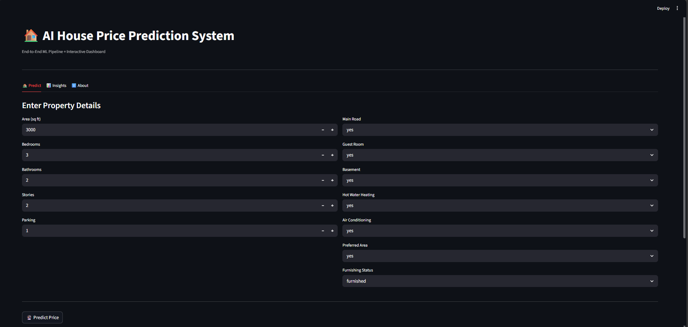
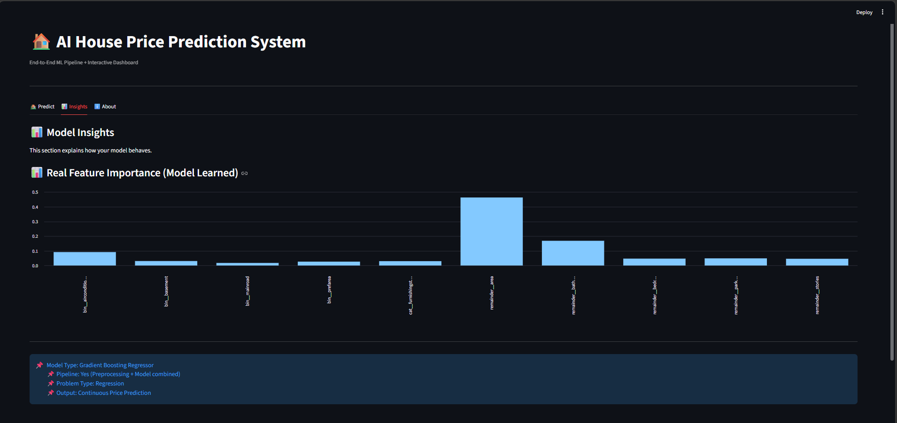
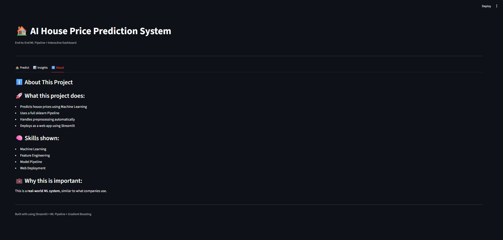
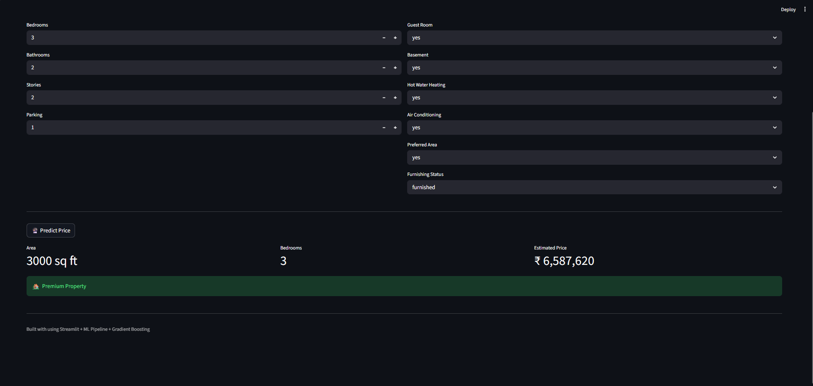

# 🏠 House Price Prediction using Machine Learning

An end-to-end Machine Learning project that predicts house prices based on user input features using a trained **Gradient Boosting Regressor Pipeline** and deployed using **Streamlit**.

---

## 🚀 Live Demo
(If deployed, add link here)

---

## 📌 Project Overview

This project predicts house prices based on multiple features such as:
- Area
- Bedrooms
- Bathrooms
- Stories
- Parking
- Location features
- Furnishing status

The model is trained using a **Scikit-learn Pipeline**, which handles preprocessing + model training in one workflow.

---

## 🧠 Machine Learning Workflow

- Data Collection (Housing Dataset)
- Data Preprocessing (Encoding categorical variables)
- Model Training (Gradient Boosting Regressor)
- Pipeline Creation
- Model Evaluation
- Deployment using Streamlit

---

## 🧰 Tech Stack

- Python
- Pandas, NumPy
- Scikit-learn
- Streamlit
- Joblib
- Matplotlib (optional for feature importance)

---

## 📊 Model Details

- Model: Gradient Boosting Regressor
- Type: Regression Problem
- Output: Continuous House Price Prediction
- Evaluation Metric: R² Score, MAE, MSE

---

## 🖥️ Web App Features

- Interactive UI using Streamlit
- Real-time prediction
- Input summary dashboard
- Feature importance visualization
- Tab-based navigation (Predict / Insights / About)

---

## 📸 Screenshots

### 🏡 Tab 1: Prediction Page

---

### 📊 Tab 2: Insights Page

---

### ℹ️ Tab 3: About Page

---

### 🔮 Final Prediction Output

---

## 📁 Project Structure

House-Price-Prediction/
│
├── app.py
├── model/
│   └── house_price_pipeline.pkl
├── data/
│   └── Housing.csv
├── screenshots/
│   ├── tab1_prediction.png
│   ├── tab2_insights.png
│   ├── tab3_about.png
│   └── prediction_result.png
├── requirements.txt
└── README.md

---

## ⚙️ How to Run This Project

### 1. Clone Repository

git clone https://github.com/yourusername/House-Price-Prediction.git

### 2. Install Dependencies
pip install -r requirements.txt

---

## 📈 Results

- Good prediction accuracy using Gradient Boosting
- Stable pipeline ensures consistent preprocessing
- Real-time interactive predictions

---

## 🎯 Future Improvements

- Add SHAP explainability
- Deploy on Streamlit Cloud
- Add model comparison (Random Forest, XGBoost)
- Improve UI with Plotly charts

---

## 👨‍💻 Author

- Developed by: Charu haasini
- Domain: Machine Learning | AI & Data Science
